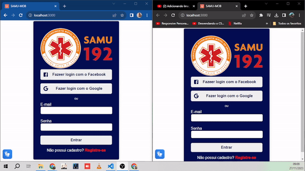

<h4 align="center">
    

</h4>

<h1 align="center">
    🚀 SAMU-MOB
</h1>

<p align="# Projeto SAMU-Mob: Inovação e Acessibilidade na Chamada de Emergência

No cenário atual, a tecnologia desempenha um papel crucial em diversas áreas, e a saúde não é exceção. O Projeto SAMU-Mob surge como uma proposta inovadora que visa melhorar a acessibilidade e eficiência no processo de chamada de emergência, proporcionando uma aplicação ágil e intuitiva para usuários de todas as habilidades.

## Objetivo e Finalidade:

O principal objetivo do Projeto SAMU-Mob é propor uma solução tecnológica que simplifique o acionamento do Serviço de Atendimento Móvel de Urgência (SAMU) de forma acessível a todos. A aplicação busca eliminar barreiras para pessoas com diferentes níveis de habilidade, promovendo a inclusão e garantindo que qualquer cidadão possa solicitar ajuda em situações críticas.</p>


<h3 align="center"> 
🚧  Em Desenvolvimento  🚧
</h3>


### 💻 Projeto
Projeto desenvolvido para simulação da protótipação da aplicação proposta .

### ✅ Demonstração
<h4 align="center">
    

</h4>

### ⚙ Pré-requisitos

Antes de começar, você vai precisar ter instalado em sua máquina as seguintes ferramentas:
[Git](https://git-scm.com), [Node.js](https://nodejs.org/en/)  
Além disto é bom ter um editor para trabalhar com o código como [VSCode](https://code.visualstudio.com/)

### 📗 Rodando a Aplicação (web)

```bash
# Clone este repositório
$ git clone https://github.com/joseGjr/samuonline.git

### 🚀 Tecnologias

Esse projeto foi desenvolvido com as seguintes tecnologias:

- HTML
- CSS
- JAVA SCRIPT
- React
- Vlibras
- Firebase
- SpeechRecognation

HTML (Hypertext Markup Language): A estrutura fundamental da aplicação foi construída com HTML, garantindo uma base sólida para a apresentação de conteúdo na web.

CSS (Cascading Style Sheets): A estilização e o design responsivo da aplicação foram desenvolvidos com CSS, proporcionando uma experiência de usuário agradável e acessível em diferentes dispositivos e tamanhos de tela.

JavaScript: A lógica dinâmica e interativa do SAMU-Mob foi implementada utilizando JavaScript. Isso possibilita a resposta em tempo real às ações do usuário, tornando a aplicação mais fluida e eficiente.

React: O framework React foi escolhido para a construção da interface do usuário (UI), permitindo a criação de componentes reutilizáveis e a atualização eficiente da interface com base nas interações do usuário. Isso contribui para uma experiência mais intuitiva e responsiva.

Firebase: Para a gestão de dados em tempo real e o armazenamento seguro das informações dos usuários, o Firebase, plataforma de desenvolvimento de aplicativos da Google, foi integrado ao SAMU-Mob. Isso possibilita uma comunicação eficaz entre a aplicação e os serviços de emergência.

SpeechRecognition: A integração do SpeechRecognition permite que os usuários acionem o SAMU-Mob por meio do reconhecimento de voz, facilitando especialmente aqueles com limitações motoras. Essa funcionalidade amplia a acessibilidade, permitindo chamadas de emergência de forma rápida e eficaz.

VLibras: A inclusão da VLibras (Língua Brasileira de Sinais Virtual) na aplicação garante acessibilidade para usuários surdos, proporcionando uma comunicação eficaz em situações de emergência. Isso é fundamental para garantir que a aplicação atenda a todos, independentemente das habilidades auditivas.

### 📕 Biblioteca

-Styled-components
